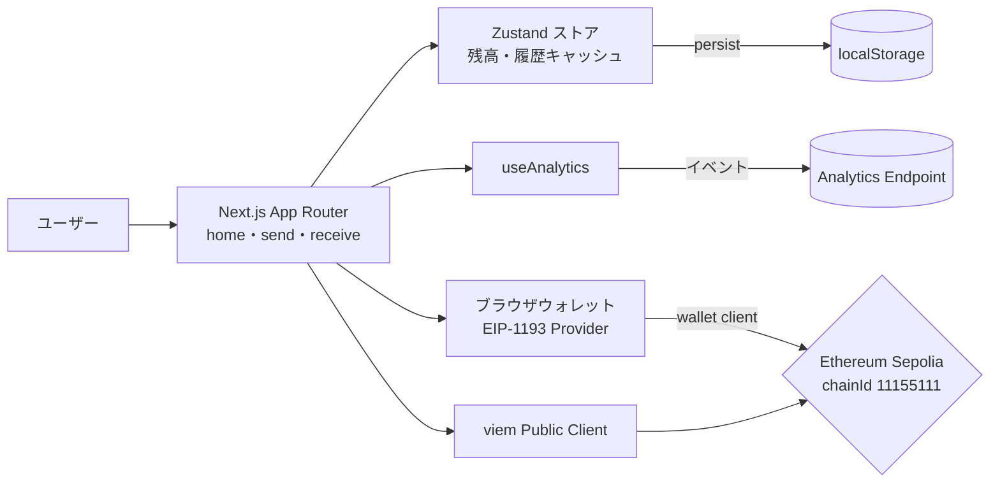

# PalPay (Sepolia JPYCウォレットMVP)

PalPay は Ethereum テストネットの Sepolia 上で JPYC トークンを「見る・送る・受け取る」に絞って体験できるミニマルなウォレット Web アプリです。ウォレット未経験者でも 60 秒以内に送金完了できることを目標。

## プロダクト全体像
- **対象ネットワーク:** Ethereum Sepolia テストネット (`chainId: 11155111` 固定)
- **対象トークン:** JPYC テスト用 ERC-20（18 桁、シンボル `JPYC`）
- **画面構成:** ホーム（残高） / 送る / 受け取る の 3 画面のみ
- **想定ユーザー:** 暗号資産に不慣れなユーザー。専門用語は排除し、必要な情報だけを段階的に提示します。

## 主な機能
- ウォレット接続と Sepolia チェーン整合性チェック（異なるチェーンは切替ダイアログ）
- JPYC 残高表示と 3 件までのミニ履歴（ローカルキャッシュ）
- 宛先入力（EIP-55 アドレス検証・ENS 解決・ペースト検知）、金額キーパッド、ガス残高チェック
- 署名前確認ステップ（手数料込み総額・到着目安）と進行トラッカー、完了トースト
- 受け取り QR（EIP-681 形式）とコピー／共有アクション
- カスタムイベント計測（`view/send/complete/error_*`）とセッション ID 付与

## 技術スタック
- Next.js 15.5.6（App Router） / React 19.2 / TypeScript 5.6
- 状態管理: Zustand（ローカルストレージ永続化）
- ブロックチェーン: viem（public client + wallet client）
- UI: CSS Modules + 共通 UI コンポーネント (`src/components`)
- テスト: Vitest（ユニット） + Playwright（E2E、`mcp_docker` 実行）

## アーキテクチャ概要
Zustand ストアでウォレット状態と履歴を一元管理し、viem の public/wallet client で Sepolia 上の JPYC コントラクトへアクセスする構成です。分析イベントは `useAnalytics` がキューイングし、任意のエンドポイントへ送信できます。



## ディレクトリ構成（主要部分）
```text
palpay/
├─ src/
│  ├─ app/                # Next.js App Router ルート
│  │  ├─ home/            # ホーム画面 (残高・履歴表示)
│  │  ├─ send/            # 送金フロー（宛先・金額・確認）
│  │  ├─ receive/         # 受取画面（QR/EIP-681）
│  │  └─ layout.tsx       # 共有レイアウト
│  ├─ components/         # ボタン・カードなどの共通 UI
│  ├─ lib/
│  │  ├─ chain/           # viem クライアント、EIP-681 生成、ガス計算 等
│  │  ├─ analytics/       # カスタムイベント送信フック
│  │  ├─ format/          # 住所・金額フォーマッタ
│  │  └─ i18n/            # マイクロコピー定義
│  ├─ store/              # Zustand ストア（残高・履歴・ウォレット状態）
│  └─ types/              # 共通型定義
├─ tests/
│  ├─ unit/               # Vitest（chain ユーティリティ・送金 UI）
│  └─ e2e/                # Playwright シナリオ（flow.<feature>.spec.ts）
├─ public/                # QR/アイコン等のアセット
├─ spec.md                # 受入要件・文言ソース
└─ TODO.md                # 残タスク一覧
```

## 前提環境
- Node.js 18 以上（Next.js 15 推奨条件）
- pnpm 8 以上
- テストネット用ウォレット（MetaMask など EIP-1193 対応）
- Sepolia ETH（ガス用）と JPYC テストトークン

## セットアップ手順
1. 依存関係をインストール
   ```bash
   pnpm install
   ```
2. `.env.local` を作成し、少なくとも以下を設定
   ```env
   NEXT_PUBLIC_CHAIN_ID=11155111
   NEXT_PUBLIC_JPYC_ADDRESS=<JPYC コントラクトアドレス>
   # 任意: NEXT_PUBLIC_SEPOLIA_RPC_URL=https://...
   # 任意: NEXT_PUBLIC_ANALYTICS_ENDPOINT=https://...
   ```
   テンプレートは `.env.example` を参照してください。
3. 開発サーバーを起動
   ```bash
   pnpm dev
   ```
   ブラウザで <http://localhost:3000> を開くと Sepolia バナー付きの UI が表示されます。

## 利用可能なコマンド
| コマンド | 目的 |
| --- | --- |
| `pnpm dev` | Next.js 開発サーバー（ホットリロード） |
| `pnpm build` | 本番ビルド + 型チェック |
| `pnpm start` | `pnpm build` 後のローカル実行 |
| `pnpm lint` | ESLint + Prettier のチェックモード |
| `pnpm test` | Vitest によるユニットテスト（viem モック含む） |

> **メモ:** CI は用意していません。PR 前に `pnpm lint` / `pnpm test` / `pnpm test:e2e` をローカルで実行し、成功ログを残してください。

## ブロックチェーンまわりの実装ポイント
- `src/lib/chain/client.ts`: Sepolia 用 public client を生成（RPC URL は環境変数 fallback）
- `src/lib/chain/wallet.ts`: `ensureSepoliaChain` でチェーン強制、ウォレットアカウント取得をラップ
- `src/lib/chain/transfer.ts`: JPYC コントラクトの `transfer` 呼び出しを抽象化
- `src/lib/chain/eip681.ts`: 受取用 EIP-681 URI を生成し QR へ埋め込み
- `src/lib/chain/gas.ts`: ガス代推定とサフィシェンシーチェックを提供

## 状態管理と履歴
- `src/store/walletStore.ts` がウォレット状態を一元管理（Zustand + `persist`）
- 残高・履歴は初回ロード時に viem から同期し、ローカルストレージに 50 件まで保持
- 送金完了時は履歴に Optimistic 追加 → Tx 確定後に状態更新


## トラブルシューティング
- **JPYC アドレス未設定:** `NEXT_PUBLIC_JPYC_ADDRESS` が空の場合、起動時に警告・送金時にエラーになります
- **Sepolia 以外に接続された:** ウォレット側でチェーンを切り替えると、アプリが再試行を促します
- **ガス不足表示:** テスト ETH が推定ガス＋バッファに満たない場合は送金ボタンが活性化しません。Sepolia faucet で補充してください
- **ENS 解決が失敗する:** `publicClient.getEnsAddress` は null を返すとエラーバナーを表示します。スペルを再確認してください
